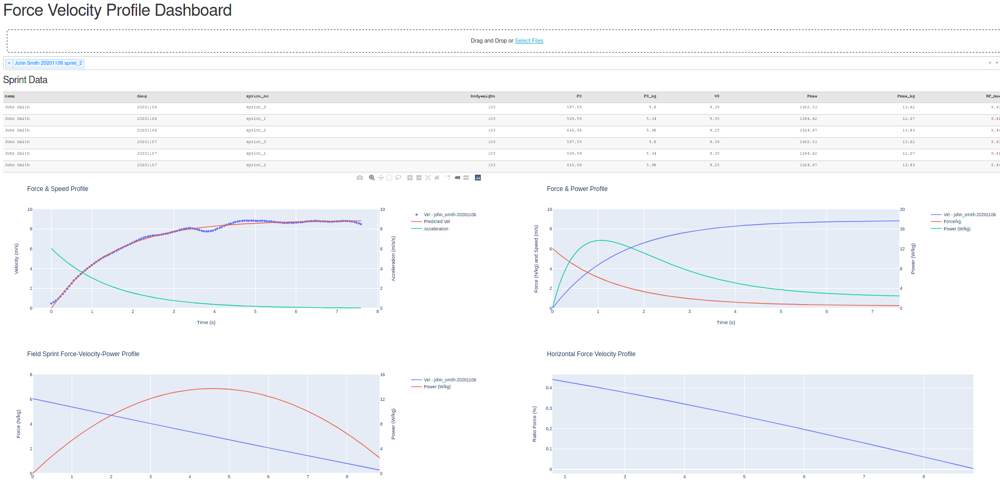

# Force Velocity Profiling App

Small Python/Dash based app for force velocity profiling. This is a python implementation of work by Math Lacome/JB Morin/Mladen Jovanovic.  

A few notes:
* File names should be in the format "firstname_surname-bodyweight-date" e.g. "john_smith-96-20201101".
* This was setup with the output of a gps system where the time column is the first column and the velocity column is the third.
* Ideally it should just the be GPS export from the max sprint efforts, else the code will struggle to extract just the peaks from a longer session.
  

[The app is hosted at force-velocity-profile.herokuapp.com](https://force-velocity-profile.herokuapp.com)

